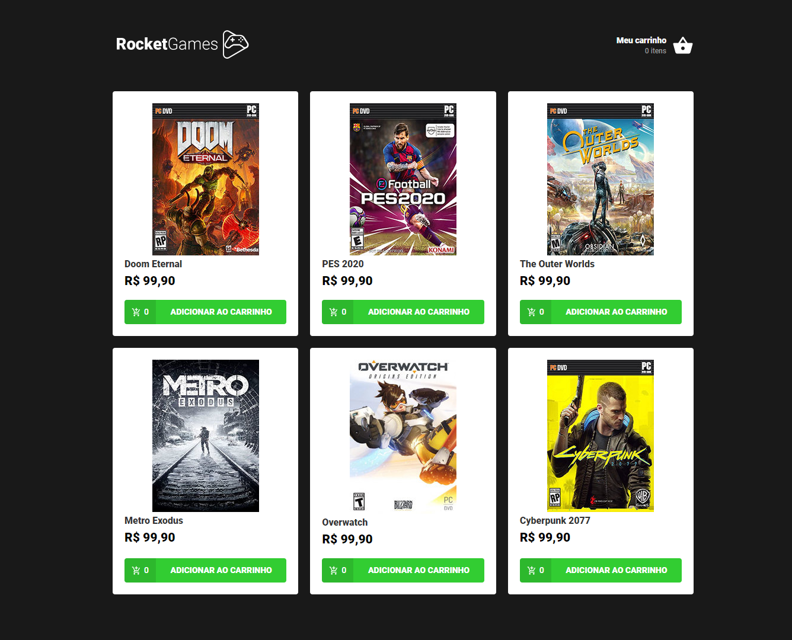
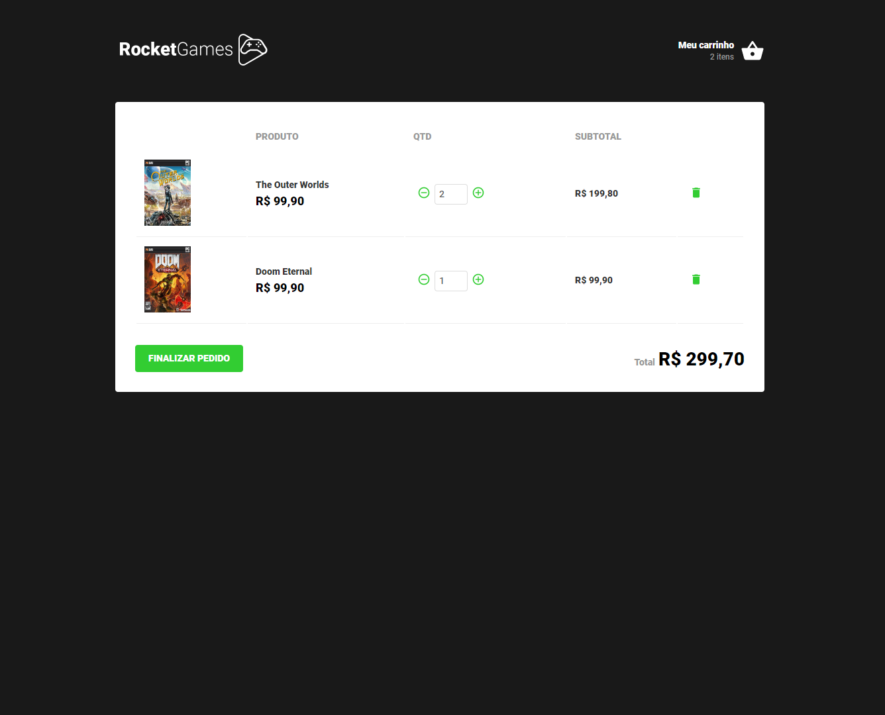

<h1 align="center" color="black">
  
</h1>

<h1 align="center">
  

    
    
  

    
</h1>

### 📜 Sobre
O RocketGames é um e-commerce feito em ReactJS para testar algumas funcionalidades básicas do ReactJs e de como um e-commerce funciona.

### 🔽 Requisitos
1. Ter o **NodeJs** e o **Yarn** instalado

### :rocket: Começando
1. ``git clone https://github.com/Negreyscow/RocketGames``
2. ``cd RocketGames``

### 💻 Iniciando com o Front-end 
1. ``cd frontend``
2. ``yarn``
3. Utilizar o ``json-server --watch server.json`` para iniciar a api de teste.
4. ``yarn start`

### 🧰  Ferramentas utilizadas
- ⚛️ **ReactJs** - Biblioteca Javascript para criar interfaces de usuário.
- ⚙️ **Json Server** - Cria uma Fake REST Api.

 por Leonardo Caracho 

